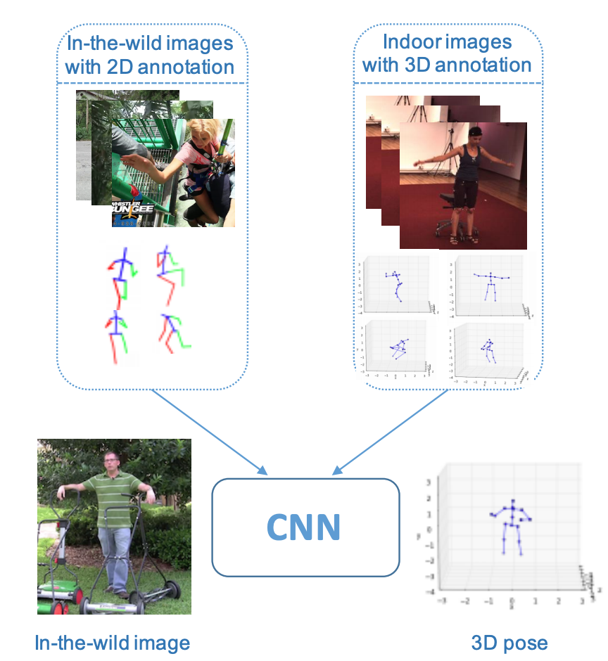

# 3D pose estimation from a simple RGB image implementated by PyTorch for ROS

This repository is entirely from the paper:**Towards 3D Human Pose Estimation in the Wild: a Weakly-supervised Approach**([arXiv:1704.02447](https://arxiv.org/abs/1704.02447)). [Code](https://github.com/xingyizhou/pytorch-pose-hg-3d).  

 
  

In this paper the author proposes a weakly-supervised transfer learning method that uses mixed 2D and 3D labels in a unified deep neutral network that presents two-stage cascaded structure. The network augments a state-of-the-art(2017) 2D pose estimation sub-network with a 3D depth regression sub-network. Unlike previous two stage approaches that train the two sub-networks sequentially and separately, our training is end-to-end and fully exploits the correlation between the 2D pose and depth estimation sub-tasks. The deep features are better learnt through shared representations. In doing so, the 3D pose labels in controlled lab environments are transferred to in the wild images. In addition, we introduce a 3D geometric constraint to regularize the 3D pose prediction, which is effective in the absence of ground truth depth labels. 

## Added functionality

I just visualized the author's 3D pose estimation results on ROS Rviz. The effect is as follows:

**Note: ** I only modified the following files:
- modified **pytorch-pose-hg-3d/src/demo.py** into **demo_ros.py** for ROS RViz. Also, the **demo.py** and **pytorch-pose-hg-3d/src/lib/utils/debugger.py** has modified to estimate pose from the video or image.
- modified the function **get_preds_3d(heatmap, depthmap)** in **pytorch-pose-hg-3d/src/lib/utils/eval.py** into **get_preds_3d_(heatmap, depthmap)**.
- add the **rviz** package in  **pytorch-pose-hg-3d/src/rviz for ROS**.

## Requirements
It is recommended to install python requirements in a virtual environment created by conda.  
Create an virtual environment named pose_estimation_ros in conda:
~~~
# create env and install requirements
> conda create -n pose_estimation_ros python=2.7 matplotlib
# activate the env
> source activate pose_estimation_ros
# install rosinstall (needed if you using a conda env)
> pip install rosinstall
# install ROS's own dependency on cv2
> conda install libgcc
~~~
- python(2.7)
- PyTorch(1.0)
- ROS(Kinetic Kame on Ubuntu 16.04 or Melodic Morenia on Ubuntu 18.04)
- matplotlib
- opencv

## Install
Pretend that you have installed the above dependencies.
1. Create a ROS workpsace
~~~
# activate the env
> source activate pose_estimation_ros
# the path /opt/ros/melodic/setup.bash depended the version of your installed ros
> source /opt/ros/melodic/setup.bash
> mkdir -p pose_estimation_ws/src && cd pose_estimation_ws
> catkin_make
> source ./devel/setup.bash
~~~

2. Clone the repo:
~~~
> cd src
> POSE_ROOT=/path/to/clone/pytorch-pose-hg-3d
> git clone https://github.com/mengyingfei/pose-3d-pytorch-ros POSE_ROOT
> cd ..
> catkin_make
> source ./devel/setup.bash
~~~

## Testing  
Download  pre-trained [model](https://drive.google.com/a/utexas.edu/file/d/1mUEybux3YZ2VhSjs-k4kBadbrT5qx09i/view?usp=sharing) and move it to `models`.  
> Open terminal  
~~~
> roscore
~~~
> Open another terminal  
~~~
> rosrun pose-3d-pytorch-ros demo_ros.py --demo /path/to/video
~~~  
> Open another terminal  
~~~
> rosrun rviz rviz
~~~  

Finally you will see the effect shown above!
